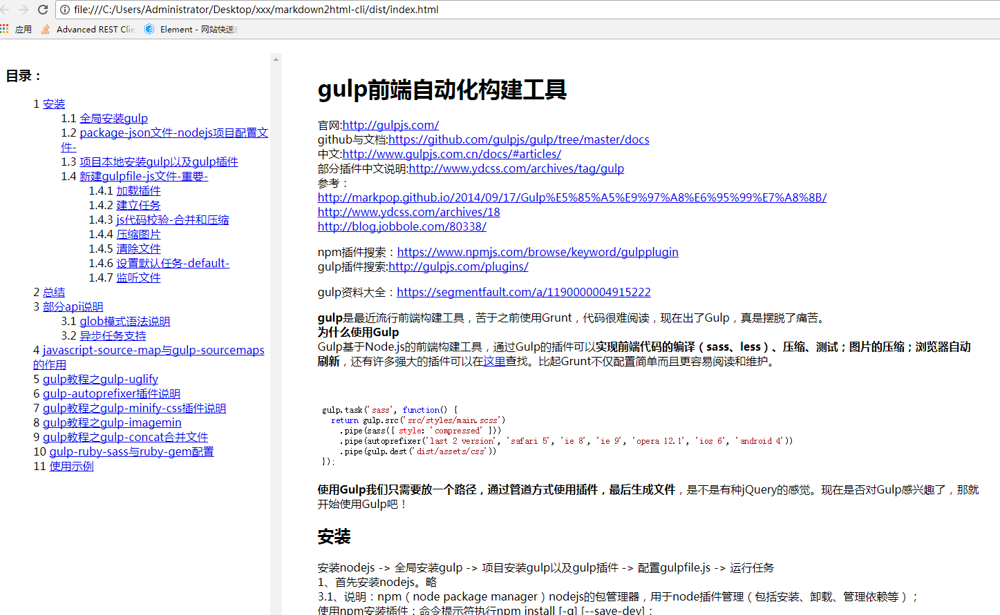

# markdown2html-cli
Markdown to HTML use gulp ,support `auto toc` , `syntax highlight`.

## How to use?
Move to the root dir of project, rename your md file to index.md, run:  
```
npm install
```
then run:   
```
gulp tohtml    
```
The generated file located in  dist/index.html.

But, what if i want to **real-time preview** when i write markdown file?Don't worry.  You can use `gulp watch` like below:   
1、first you should install chrome ext named livereload    
2、ordered run commandline:   
```sh
$ cd your_work_dir
$ http-server    ;;;if your have not install it.please run   npm install -g http-server
$ gulp watch
```
Now you can open `127.0.0.1:8080/index.html` to see it.  

### Cli args:
- --path : the work filepath ,it support gulp path syntax like \*.md,\*\*/\*.md,etc. 
- --title: the file title.

Example use:  
```
gulp tohtml --path **/*.md --title demo-page 
```

AnyWhere,Before you start your work for it ,now please see dist/index.html.  The source code of index.md is a demo article, the generated index.html look like below:   

    
